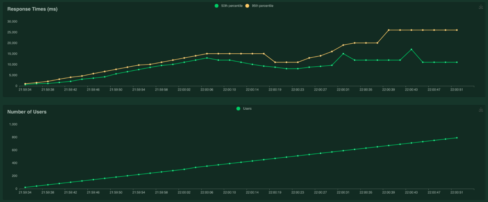

# API Loading-Testing (Python+Locust+Gunicorn+Flask)

This repo illustrates how to use [locust](https://github.com/locustio/locust) for load-testing, using some toy Flask endpoints. 



```bash
# start local gunicorn server in background
gunicorn \
--bind :5000 \
--workers 1 \
--threads 8 \
--timeout 10 \
--access-logfile "-" \
--log-level info \
flask_app:app &

# run load-test in locust #
locust --host http://localhost:5000
# (then navigate to specified url in your browser)

# stop gunicorn server #
GUNICORN_PID=$(pgrep -f "gunicorn .* flask_app:app")
kill -SIGTERM $GUNICORN_PID
```